# Unity1Week_20230918

# 操作方法
- 左クリック or タップ

# デモ

# 開発環境
unity 2022.3.4f1

# お題
「1ボタン」

# 設計
## 遷移

## 案出し

## ツール
|Name|Version|
|---|---|
|Draw.io Integration|1.6.6|

## 使用アセット
|Name|Version|
|---|---|
|[UniRX](https://github.com/neuecc/UniRx)|6.2.2|
|[MagicTween](https://github.com/AnnulusGames/MagicTween.git)|0.1.2|
|[ncmb_unity](https://github.com/NIFCLOUD-mbaas/ncmb_unity)|5.1.0|
|[unity-simple-ranking](https://github.com/naichilab/unity-simple-ranking)|2.2|
|[Unityroom Client Library](https://github.com/naichilab/unityroom-client-library)|0.9.4|

## 素材
BGM
- 

